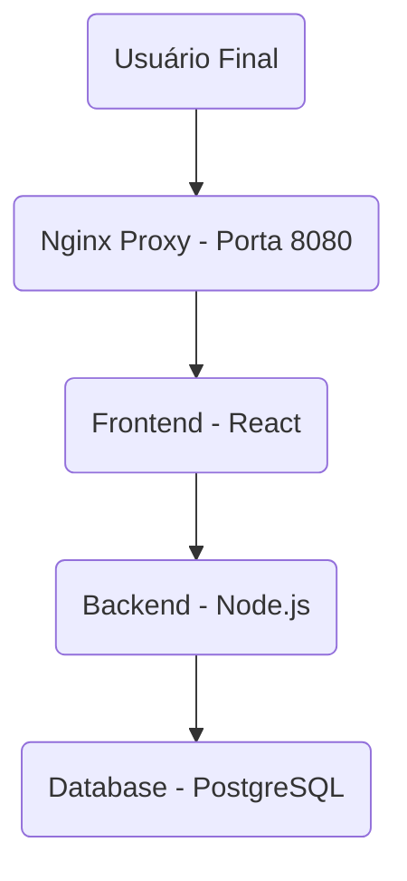

# 🛠️ Desafio Técnico DevOps - Infraestrutura como Código

Este projeto implementa uma aplicação web completa (frontend, backend, banco de dados) utilizando **Kubernetes** e **Terraform** para orquestração de containers. A infraestrutura é definida como código, permitindo deploy consistente e reproduzível.

---

## 📝 Índice

- [🏗️ Arquitetura](#️-arquitetura)
- [🌐 Redes e Topologia no Kubernetes](#-redes-e-topologia-no-kubernetes)
- [🩺 Health Checks](#-health-checks)
  - [Como Funcionam no Projeto (Probes do Kubernetes):](#como-funcionam-no-projeto-probes-do-kubernetes)
  - [Como o Avaliador Pode Verificar:](#como-o-avaliador-pode-verificar)
- [📁 Estrutura do Projeto](#-estrutura-do-projeto)
- [🛠️ Pré-requisitos](#️-pré-requisitos)
- [🔧 Instalação de Dependências](#-instalação-de-dependências)
  - [1. Minikube](#1-minikube)
  - [2. kubectl](#2-kubectl)
  - [3. Terraform](#3-terraform)
- [🏃 Como Executar o Projeto](#-como-executar-o-projeto)
  - [🚀 Gerenciamento de Ambiente com Kubernetes e Terraform](#-gerenciamento-de-ambiente-com-kubernetes-e-terraform)
  - [1️⃣ Clone o Repositório](#1-clone-o-repositório)
  - [1️⃣.1 Iniciar e Configurar Minikube](#11-iniciar-e-configurar-minikube)
  - [2️⃣ Inicialize o Terraform](#2-inicialize-o-terraform)
  - [3️⃣ Revise o Plano de Execução (Opcional)](#3-revise-o-plano-de-execução-opcional)
  - [4️⃣ Execute a Infraestrutura](#4-execute-a-infraestrutura)
  - [5️⃣ Acesse a Aplicação](#5-acesse-a-aplicação)
  - [6️⃣ Limpeza do Ambiente](#6-limpeza-do-ambiente)
- [🐛 Resolução de Problemas Comuns](#-resolução-de-problemas-comuns)
  - [1. Minikube Não Está em Execução](#1-minikube-não-está-em-execução)
  - [2. Erros Durante `terraform apply`](#2-erros-durante-terraform-apply)
  - [3. Pods Não Iniciam ou Entram em `CrashLoopBackOff`](#3-pods-não-iniciam-ou-entram-em-crashloopbackoff)
  - [4. Aplicação Não Acessível em `http://localhost:30080`](#4-aplicação-não-acessível-em-httplocalhost30080)
- [📊 Observabilidade](#-observabilidade)
  - [1. Logs dos Pods](#1-logs-dos-pods)
  - [2. Health Checks (Probes)](#2-health-checks-probes)
- [💾 Persistência de Dados](#-persistência-de-dados)
  - [1. Persistent Volumes (PV) e Persistent Volume Claims (PVC)](#1-persistent-volumes-pv-e-persistent-volume-claims-pvc)
---

# 🏗️ Arquitetura


## 🌐 Redes e Topologia no Kubernetes

No Kubernetes, a comunicação entre os serviços é gerenciada por meio de **Services**, que fornecem uma camada de abstração sobre os Pods. O projeto está implantado no namespace `desafio-devops`.

### Componentes e Comunicação:

1.  **Nginx Proxy Service (`nginx-proxy-service`)**
    *   **Tipo:** `NodePort`
    *   **Propósito:** Este é o ponto de entrada externo da aplicação. Ele expõe a porta `30080` em cada nó do cluster Kubernetes, permitindo que o tráfego externo chegue à aplicação. Internamente, ele roteia as requisições para o Pod do Nginx na porta `80`.
    *   **Comunicação:** Recebe requisições externas e as encaminha para o `frontend-service`.

2.  **Frontend Service (`frontend-service`)**
    *   **Tipo:** `ClusterIP`
    *   **Propósito:** Fornece um IP virtual estável para os Pods do Frontend, permitindo que outros serviços dentro do cluster se comuniquem com o Frontend.
    *   **Comunicação:** O Nginx Proxy se comunica com este Service. O Frontend, por sua vez, se comunica com o `backend-service`.

3.  **Backend Service (`backend-service`)**
    *   **Tipo:** `ClusterIP`
    *   **Propósito:** Fornece um IP virtual estável para os Pods do Backend.
    *   **Comunicação:** O Frontend se comunica com este Service. O Backend, por sua vez, se comunica com o `postgres-service`.

4.  **Database Service (`postgres-service`)**
    *   **Tipo:** `ClusterIP`
    *   **Propósito:** Fornece um IP virtual estável para o Pod do PostgreSQL.
    *   **Comunicação:** Acessível apenas pelo `backend-service`, garantindo que o banco de dados não seja exposto diretamente a outros serviços ou externamente.

### Topologia de Rede Resumida:

```
Usuário Final (Porta 30080 do Nó)
      ↓
[Nginx Proxy Service (NodePort)]
      ↓
[Frontend Service (ClusterIP)]
      ↓
[Backend Service (ClusterIP)]
      ↓
[Database Service (ClusterIP)]
```

Esta configuração garante que apenas o Nginx Proxy seja acessível externamente, enquanto os outros serviços (Frontend, Backend, Database) se comunicam de forma segura e isolada dentro do cluster Kubernetes, utilizando os mecanismos de descoberta de serviços do Kubernetes.

## 🩺 Health Checks

Os health checks são mecanismos cruciais para a orquestração e a resiliência da aplicação, especialmente quando gerenciada pelo Terraform e Kubernetes. Eles permitem que o orquestrador determine o estado de saúde de cada Pod e tome ações corretivas, como reiniciar um Pod que não está respondendo.

### Como Funcionam no Projeto (Probes do Kubernetes):

No Kubernetes, os health checks são implementados através de Probes (Liveness e Readiness) configuradas nos arquivos de Deployment de cada serviço.

1.  **Liveness Probe:**
    *   **Propósito:** Indica se o contêiner está em execução. Se a Liveness Probe falhar, o Kubernetes reiniciará o contêiner.
    *   **Exemplo (Backend):** Verifica um endpoint HTTP `/health`.
        ```yaml
        livenessProbe:
          httpGet:
            path: /health
            port: 3000
          initialDelaySeconds: 40
          periodSeconds: 30
          timeoutSeconds: 5
          failureThreshold: 3
        ```

2.  **Readiness Probe:**
    *   **Propósito:** Indica se o contêiner está pronto para servir tráfego. Se a Readiness Probe falhar, o Kubernetes removerá o Pod dos endpoints do Service até que ele esteja pronto novamente.
    *   **Exemplo (Database):** Verifica a conexão com o banco de dados usando `pg_isready`.
        ```yaml
        readinessProbe:
          exec:
            command: ["pg_isready", "-U", "postgres", "-d", "desafio_db"]
          initialDelaySeconds: 5
          periodSeconds: 30
          timeoutSeconds: 3
          failureThreshold: 3
        ```

### Como o Avaliador Pode Verificar:

Após executar `terraform apply` e os recursos do Kubernetes serem provisionados, você pode verificar o status dos health checks dos Pods usando os comandos `kubectl`:

-   **Verificar Status Geral dos Pods:**
    ```bash
    kubectl get pods
    ```
    Observe a coluna `STATUS`. Pods saudáveis exibirão `Running` e, se houver problemas com as probes, você poderá ver `CrashLoopBackOff` ou outros estados de erro.

-   **Inspecionar Detalhes de um Pod (incluindo eventos das Probes):**
    ```bash
    kubectl describe pod <nome_do_pod>
    ```
    (Ex: `kubectl describe pod backend-xxxxxxxxx-xxxxx`)
    Este comando mostrará eventos relacionados às Liveness e Readiness Probes, indicando se elas estão falhando e por quê.

-   **Verificar Logs de um Pod:**
    ```bash
    kubectl logs <nome_do_pod>
    ```
    (Ex: `kubectl logs backend-xxxxxxxxx-xxxxx`)
    Os logs podem fornecer informações detalhadas sobre o que está acontecendo dentro do contêiner e ajudar a diagnosticar falhas nas probes.

## 📁 Estrutura do Projeto
```
├── backend
│   ├── Dockerfile
│   ├── index.js
│   ├── package.json
│   └── package-lock.json
├── clean-docker.sh
├── database
│   ├── Dockerfile
│   └── script.sql
├── docker-compose.yml
├── frontend
│   ├── Dockerfile
│   └── index.html
├── kubernetes
│   ├── backend-configmap.yaml
│   ├── backend-deployment.yaml
│   ├── backend-service.yaml
│   ├── database-deployment.yaml
│   ├── database-persistentvolumeclaim.yaml
│   ├── database-secret.yaml
│   ├── database-service.yaml
│   ├── frontend-deployment.yaml
│   ├── frontend-service.yaml
│   ├── namespace.yaml
│   ├── proxy-configmap.yaml
│   ├── proxy-deployment.yaml
│   └── proxy-service.yaml
├── logs
│   └── app.log
├── proxy
│   ├── Dockerfile
│   └── nginx.conf
├── README.md
└── terraform
    ├── docker_build.tf
    ├── kubernetes.tf
    ├── main.tf
    ├── outputs.tf
    ├── README.md
    ├── terraform.tfstate
    ├── terraform.tfstate.backup
    └── variables.tf
```

## 🛠️ Pré-requisitos

Antes de iniciar, certifique-se de ter instalado:

- **Minikube** (versão 1.32.0 ou superior)
- **kubectl** (versão 1.28.0 ou superior)
- **Terraform** (versão 1.0 ou superior)
- **Git** para clonar o repositório

## 🔧 Instalação de Dependências

Siga os passos abaixo para instalar as dependências necessárias.

### 1. Minikube

Minikube é um cluster Kubernetes local que permite executar a aplicação em seu ambiente de desenvolvimento.

1.  **Instale o Minikube:** Siga as instruções oficiais para o seu sistema operacional: [Minikube Installation Guide](https://minikube.sigs.k8s.io/docs/start/)
2.  **Verifique a Instalação:**
    ```bash
    minikube version
    ```

### 2. kubectl

kubectl é a ferramenta de linha de comando para interagir com clusters Kubernetes.

1.  **Instale o kubectl:** Siga as instruções oficiais para o seu sistema operacional: [kubectl Installation Guide](https://kubernetes.io/docs/tasks/tools/install-kubectl/)
2.  **Verifique a Instalação:**
    ```bash
    kubectl version --client
    ```

### 3. Terraform

O Terraform é usado para gerenciar a infraestrutura no Kubernetes.

1.  **Instale o Terraform:** Siga as instruções oficiais para o seu sistema operacional: [Terraform Installation Guide](https://learn.hashicorp.com/tutorials/terraform/install-cli)
2.  **Verifique a Instalação:**
    ```bash
    terraform --version
    ```
---
## 🏃 Como Executar o Projeto

Siga os passos abaixo no terminal:

### 🚀 Gerenciamento de Ambiente com Kubernetes e Terraform

### 1️⃣ Clone o Repositório

Baixe o código-fonte:

```bash
git clone [https://github.com/ohgabrieldias/desafio-tecnico-devops.git](https://github.com/ohgabrieldias/desafio-tecnico-devops.git)
cd desafio-tecnico-devops
```

### 1️⃣.1 Iniciar e Configurar Minikube

Antes de prosseguir com o Terraform, certifique-se de que o Minikube está em execução e que o `kubectl` está configurado para interagir com ele.

1.  **Iniciar o Minikube:**
    ```bash
    minikube start
    ```
2.  **Verificar o Status do Minikube:**
    ```bash
    minikube status
    ```
3.  **Configurar o Contexto do kubectl (Opcional, mas recomendado):**
    ```bash
    kubectl config use-context minikube
    # Para simplificar comandos futuros, você pode criar um alias:
    alias kubectl="minikube kubectl --"
    ```
4.  **Configurar o Ambiente Docker do Minikube:**
    ```bash
    eval $(minikube docker-env)
    ```
    *Este comando configura seu shell para usar o daemon Docker do Minikube, permitindo que você construa imagens diretamente no ambiente do Minikube.*
5.  **Obter o IP do Minikube e Atualizar o Terraform:**
    *   Obtenha o IP do seu cluster Minikube:
        ```bash
        minikube ip
        ```
    *   **Importante:** Você precisará usar este IP para configurar a variável `minikube_ip` no arquivo `terraform/main.tf`. Abra o arquivo e atualize a linha correspondente:
        ```terraform
        minikube_ip = "SEU_IP_DO_MINIKUBE_AQUI" # Ex: minikube_ip = "192.168.49.2"
        ```

### 2️⃣ Inicialize o Terraform
Acesse a pasta de configuração e prepare o ambiente:
```bash
cd terraform
terraform init
```

### 3️⃣ Revise o Plano de Execução (Opcional)
Verifique quais recursos serão criados:
```bash
terraform plan
```
### 4️⃣ Execute a Infraestrutura
Crie e inicie os recursos (Docker, Redes, etc.):
```bash
terraform apply
```
Digite yes para confirmar.

**⚠️ Importante:** Após a execução do `terraform apply`, é altamente recomendável aguardar cerca de 1 a 2 minutos para que todos os Pods do Kubernetes estabilizem e iniciem corretamente. Você pode monitorar o status dos Pods com o seguinte comando:
```bash
kubectl get pods -n desafio-devops
```
Aguarde até que todos os Pods estejam no estado `Running` e com o número de `READY` containers correto (ex: `1/1`).

### 5️⃣ Acesse a Aplicação
A aplicação estará acessível após a execução bem-sucedida:

-   **Aplicação Principal (Frontend):** Para acessar a aplicação, você precisará obter o IP do Minikube e a porta NodePort do serviço Nginx.
    1.  **Obtenha o IP do Minikube:**
        ```bash
        minikube ip
        ```
    2.  **Acesse a Aplicação:** Abra seu navegador e navegue para `http://<IP_DO_MINIKUBE>:30080`.
        *   Esta é a interface do usuário da aplicação.
-   **API do Backend:** Para acessar a API do Backend, use o mesmo IP do Minikube e a porta `30080`, seguido do caminho `/api`.
    *   **Acesse a API:** `http://<IP_DO_MINIKUBE>:30080/api`
    *   Este endpoint expõe a API RESTful do backend. Ao acessá-lo, você receberá um JSON com o status de saúde dos serviços internos, por exemplo: `{ "database": true, "useradmin": true }`.

---

### 6️⃣ Limpeza do Ambiente

Após concluir a avaliação ou o desenvolvimento, é importante limpar os recursos criados para evitar custos desnecessários ou conflitos.

#### Para Recursos Gerenciados pelo Terraform:

1.  **Acesse a pasta do Terraform:**
    ```bash
    cd terraform
    ```
2.  **Execute o comando `terraform destroy`:**
    ```bash
    terraform destroy
    ```
    Este comando irá destruir todos os recursos Docker (containers, redes, volumes) que foram provisionados pelo Terraform. Digite `yes` para confirmar a destruição.


---

## 🐛 Resolução de Problemas Comuns

Esta seção oferece diretrizes para diagnosticar e resolver problemas que podem surgir ao iniciar o projeto pela primeira vez em um ambiente Kubernetes.

### 1. Minikube Não Está em Execução
- **Sintoma:** Erros como "The connection to the server localhost:8080 was refused - did you specify the right host or port?" ou "kubectl: command not found".
- **Solução:**
    - Certifique-se de que o Minikube está iniciado. Use `minikube start` para iniciar o cluster.
    - Verifique o status do Minikube com `minikube status`.
    - Certifique-se de que o `kubectl` está configurado para usar o contexto do Minikube: `kubectl config use-context minikube`.

### 2. Erros Durante `terraform apply`
- **Sintoma:** O comando `terraform apply` falha com mensagens de erro relacionadas à criação de recursos Kubernetes.
- **Solução:**
    - **Verifique o Minikube:** Garanta que o Minikube está em execução (veja o item 1).
    - **Logs do Terraform:** Analise a saída detalhada do Terraform para identificar qual recurso está falhando e por quê.
    - **Validação de YAML:** Verifique se os arquivos YAML na pasta `kubernetes/` estão sintaticamente corretos. Você pode validá-los com `kubectl apply --dry-run=client -f kubernetes/`.

### 3. Pods Não Iniciam ou Entram em `CrashLoopBackOff`
- **Sintoma:** Após `terraform apply`, alguns Pods não ficam no estado "Running" ou entram em `CrashLoopBackOff`.
- **Solução:**
    - **Verifique os Logs do Pod:** Use `kubectl logs <nome_do_pod> -n <namespace>` para inspecionar a saída do contêiner. Mensagens de erro no início são cruciais para entender a causa.
    - **Descreva o Pod:** Use `kubectl describe pod <nome_do_pod> -n <namespace>` para verificar eventos, status das probes (Liveness e Readiness) e mensagens de erro.
    - **ConfigMaps e Secrets:** Verifique se os ConfigMaps e Secrets necessários estão sendo montados corretamente e se os valores estão corretos.

### 4. Aplicação Não Acessível em `http://localhost:8080`
- **Sintoma:** O navegador não consegue se conectar à aplicação após a execução bem-sucedida do Terraform.
- **Solução:**
    - **Verifique o Service do Proxy:** Use `kubectl get svc -n <namespace>` para verificar se o Service do Nginx Proxy está em execução e se o tipo (NodePort ou LoadBalancer) e as portas estão corretos.
    - **Verifique o Ingress (se usado):** Se você estiver usando um Ingress, verifique seu status com `kubectl get ingress -n <namespace>` e os logs do controlador de Ingress.
    - **Port-forwarding:** Se estiver usando Minikube, pode ser necessário fazer port-forwarding para acessar a aplicação: `kubectl port-forward svc/proxy-service 8080:80 -n desafio-devops`.
    - **Firewall:** Verifique se o firewall da sua máquina não está bloqueando a porta `8080`.

---

## 📊 Observabilidade

A observabilidade é fundamental para entender o comportamento da aplicação em tempo real, identificar gargalos e diagnosticar problemas em um ambiente Kubernetes.

### 1. Logs dos Pods
- **Acesso:** Todos os contêineres em Pods Kubernetes geram logs padrão (stdout/stderr). Você pode acessá-los usando o comando `kubectl logs`.
    ```bash
    kubectl logs <nome_do_pod> -n <namespace>
    # Ex: kubectl logs backend-xxxxxxxxx-xxxxx -n desafio-devops
    ```
- **Importância:** Os logs são a primeira linha de defesa para depuração. Eles fornecem informações sobre o estado do serviço, erros, requisições e eventos importantes dentro dos contêineres.

### 2. Health Checks (Probes)
- **Monitoramento de Status:** Conforme detalhado na seção "Health Checks", cada serviço crítico possui Liveness e Readiness Probes configuradas para reportar seu estado de saúde.
- **Uso:** O Kubernetes utiliza essas probes para determinar se um Pod está apto a receber tráfego e se precisa ser reiniciado, garantindo a resiliência da aplicação.
- **Verificação Manual:** Você pode verificar o status de saúde e eventos de um Pod manualmente com `kubectl describe pod <nome_do_pod> -n <namespace>`.

---

## 💾 Persistência de Dados

A persistência dos dados é um aspecto crítico para garantir que as informações do banco de dados não sejam perdidas quando os Pods são reiniciados ou removidos em um cluster Kubernetes.

### 1. Persistent Volumes (PV) e Persistent Volume Claims (PVC)
- **Uso:** No Kubernetes, a persistência de dados é gerenciada através de Persistent Volumes (PVs) e Persistent Volume Claims (PVCs). Um PVC (`database-persistentvolumeclaim.yaml`) é criado para solicitar armazenamento, e um PV é provisionado (dinamicamente ou estaticamente) para atender a essa solicitação. O PVC é então montado no Pod do PostgreSQL (`database-deployment.yaml`) no caminho `/var/lib/postgresql/data`.
    ```yaml
    # Exemplo de PVC (kubernetes/database-persistentvolumeclaim.yaml)
    apiVersion: v1
    kind: PersistentVolumeClaim
    metadata:
      name: postgres-pv-claim
      namespace: desafio-devops
    spec:
      accessModes:
        - ReadWriteOnce
      resources:
        requests:
          storage: 1Gi
    ```
- **Benefícios:**
    - **Durabilidade:** Os dados persistem mesmo se o Pod do banco de dados for destruído e recriado, pois o PV e o PVC existem independentemente do ciclo de vida do Pod.
    - **Separação:** Separa o armazenamento da camada de aplicação, facilitando backups e migrações.
- **Gerenciamento:** PVs e PVCs são gerenciados pelo Kubernetes e podem ser inspecionados com `kubectl get pv` e `kubectl get pvc -n <namespace>`.

### 2. Inicialização do Banco de Dados
- **ConfigMap e Script SQL:** O arquivo `sql/script.sql` é utilizado para inicializar o banco de dados com um esquema e dados iniciais. No Kubernetes, este script pode ser injetado no Pod do PostgreSQL através de um ConfigMap (`backend-configmap.yaml`) e montado no caminho `/docker-entrypoint-initdb.d/init.sql` dentro do contêiner do PostgreSQL. Isso garante que o script seja executado na primeira inicialização do banco de dados.
- **Importância:** Garante que o banco de dados esteja pronto para uso com a estrutura e dados mínimos necessários para a aplicação funcionar.

---
